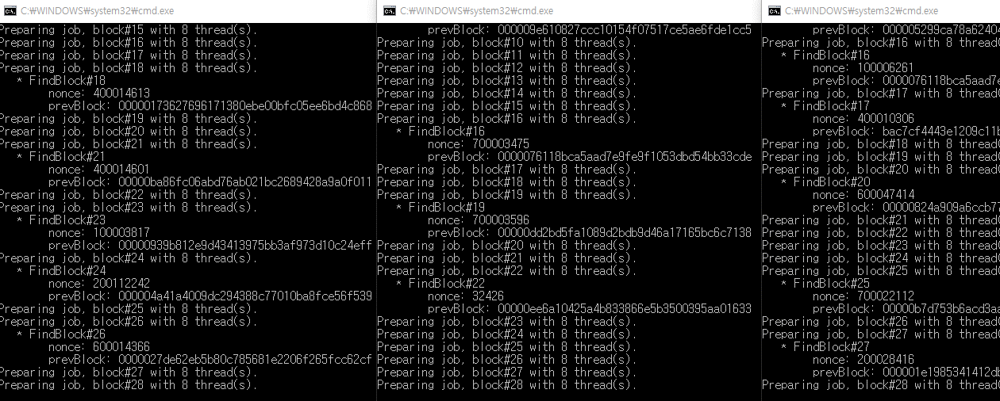

                  _       _      _           _       
                 (_)     (_)    | |         (_)      
        _ __ ___  _ _ __  _  ___| |__   __ _ _ _ __  
       | '_ ` _ \| | '_ \| |/ __| '_ \ / _` | | '_ \ 
       | | | | | | | | | | | (__| | | | (_| | | | | |
       |_| |_| |_|_|_| |_|_|\___|_| |_|\__,_|_|_| |_|
      
                Minimal implementation of blockchain
                                   Written in CSharp
                                   pjc0247@naver.com
      

Minimal implementation of __BLOCKCHAIN__, written in __CSharp__.

Sub repositories
----
* [Demonstrate 51% attack on blockchain network](https://github.com/pjc0247/minichain_51attack_demo)
* [State DB implementation](https://github.com/pjc0247/minichain_state_db)

ThingsToDo
----
* __p2p__
  * [x] Exchange peers
  * [ ] Local Discovery
* __chain__
  * __consensus__
    * [ ] Block confirmation
  * __mining__
    * [ ] Block rewards
    * [x] Dynamic difficulty
  * __wallet__
    * [ ] implements overall wallet system.
    * [x] Transaction signing
  * __txpool__
    * [ ] implements overall txpool system.
* __PoW__
  * [x] Include transactions with highest fees
  * [ ] More elaborated multithread mining

Specification
----
* __Block Structure__

* __Block Validation__
  * `txs` must be a non empty array (except genesis-block)
  * `txs[0]` must be a reward transaction.
  * Check the block has valid minerAddress
  * Check the block proper difficulty
  * Check the nonce with block difficulty
